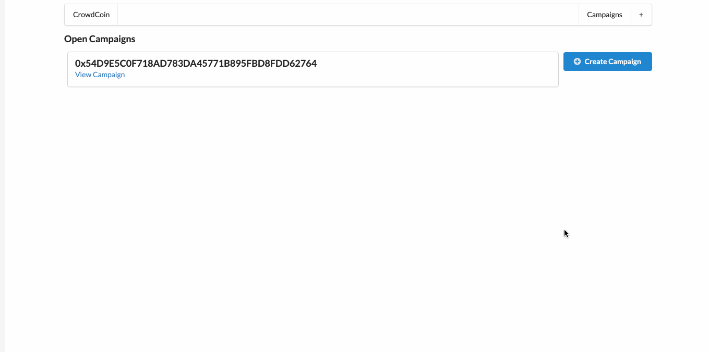
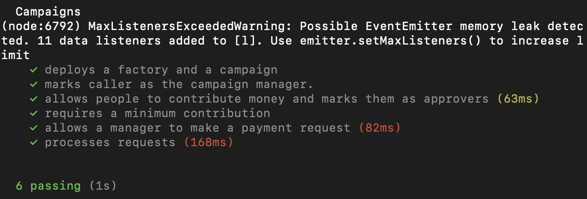

# Decentralized Crowd Funding

This project is a decentralized crowd funding platform, similar to [Kickstarter](https://www.kickstarter.com/). Normanlly, on Kickstarter, money is pledged to a campaign, which is in turn used to create the product. However, since the contributors to a campaign are essentially hands-off in that process, that does not prevent bad actors or malicious people from taking off with the campaign funds.

To combat this, this project aims to give contributors a say in how the campaign funds, in this case testnet ether, are used. How this is implemented is that campaign managers have to submit requests for how they may spend the campaign funds. The contributors would then have a vote in whether the request is approved.

For a request to be approved, it would need to have a more than 50% majority. This would then allow the funds to be used as requested.

Below is a GIF of the contract in action.



## Getting Started

These instructions will get you a copy of the project up and running on your local machine for development and testing purposes. See deployment for notes on how to deploy the project on a live system.

### Installing

To begin, first navigate to your desired local directory so you can clone the project repo. Once there, in the terminal, run the following command:

```
git clone https://github.com/RCantu92/decentralized_crowdfunding.git
```
Once you have cloned the project repo, run the following command to install all of the necessary dependencies:
```
npm install
```

The dependencies, along with other tools used, are listed under "Built With."

In addition to this, you will also need to install the [MetaMask](https://metamask.io/) browser extension.

## Running the tests

Navigate into the lottery-smart-contract/ directory, and once in there, run the
following in the command line:

```
npm run test
```
If all the tests are passed, you should an output similar to the following:



*(Note: the warning should not appear and will be looked into further.)

## Deployment

To deploy the lottery smart contract onto the Rinkeby Ethereum testnet, you would navigate back to the lottery-smart-contract directory and run the following in the command line:

```
node deploy.js
```

Once deployed, you should see message like the following:


*(Note: This is a different deployed address than the listed at the end of this README.)

To now render a local instance of contract on your browser, navigate to the root directory.

Once inside, run the following in the command line:

```
npm run dev
```

After running the above command, on your web browser navigate to [localhost:3000](http://localhost:3000/). The GIF previously shown demonstrates the process of navigating the decentralized crowd funding app.

Lastly, this contract is deployed on the rinkeby testnet under address [0xd754caE84C000cAf47644F1449274D53282814d8](https://rinkeby.etherscan.io/address/0xd754cae84c000caf47644f1449274d53282814d8).

## Built With

* [npm](https://www.npmjs.com/) - Package manager for the JavaScript programming language.
* [Solidity, v.0.4.17](https://solidity.readthedocs.io/en/v0.4.17/) - Smart Contract programming language used.
* [JavaScript](https://developer.mozilla.org/en-US/docs/Web/javascript) - Programming language used.
* [solc, v.0.4.17](https://github.com/ethereum/solc-js) - Module for compiling the Solidity programming language.
* [Mocha](https://mochajs.org/) - JavaScript test framework.
* [Ganache CLI](https://www.npmjs.com/package/ganache-cli) - The command line version of Ganache, your personal blockchain for Ethereum development.
* [fs-extra](https://github.com/jprichardson/node-fs-extra) - File system methods that aren't included in the native 'fs' module and adds promise support to the fs methods.
* [web3](https://github.com/ethereum/web3.js/) - This is the Ethereum JavaScript API which connects to the Generic JSON-RPC spec. Used v.1.0.0-beta.26.
* [Assert](https://nodejs.org/api/assert.html) - Module that provides a set of assertion functions for verifying invariants.
* [truffle-hdwallet-provider, v.0.0.3](https://github.com/trufflesuite/truffle-hdwallet-provider) - HD Wallet-enabled Web3 provider. Used to sign transactions for addresses derived from a 12-word mnemonic.
* [React](https://reactjs.org/) - JavaScript library for building user interfaces.
* [Next.js, v.4.1.4](https://nextjs.org/) - React framework.
* [MetaMask](https://metamask.io/) - Browser based wallet used to connect to the Ethereum mainnet as well as testnets.
* [Infura](https://infura.io/) - API used to access the Ethereum and IPFS networks.
* [Semantic UI React](https://react.semantic-ui.com/) - React integration for [Sematic UI](https://semantic-ui.com/).
* [Next Routes](https://github.com/fridays/next-routes) - Universal dynamic routes for Next.js.

## Authors

* **Roberto Cantu**  - [GitHub](https://github.com/RCantu92)